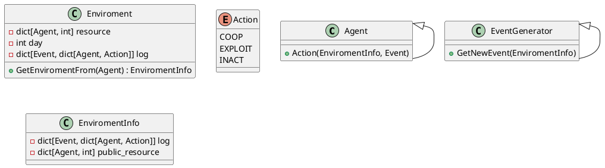

## Presentación

El proyecto de simulación se centra en la creación de un entorno virtual donde agentes autónomos interactúan entre sí y con su entorno, tomando decisiones que afectan su supervivencia. Se utiliza una serie de mecánicas de juego basadas en el dilema del prisionero para modelar las interacciones y eventos que afectan a los agentes. Este estudio investiga qué comportamientos permiten a los agentes y a sus grupos sobrevivir más tiempo, cómo las condiciones del entorno influyen en estas decisiones y el impacto de la descendencia en la adaptabilidad de las sociedades.

### Objetivo de la Simulación

El objetivo principal de esta simulación es analizar el comportamiento en sociedad de individuos que deben decidir cooperar o no frente a distintos fenómenos sociales y naturales, con el fin de sobrevivir el mayor tiempo posible. Las preguntas específicas que busca responder este estudio son:

1. ¿Qué comportamientos hacen sobrevivir al grupo la mayor cantidad de tiempo?
2. ¿Qué comportamientos hacen sobrevivir a un individuo la mayor cantidad de tiempo?
3. ¿El ladrón es el que más tiempo sobrevive?
4. ¿Cómo cambian los agentes en entornos más adversos o más favorables?
5. ¿La descendencia hace que las sociedades se adapten más fácilmente a cambios en el entorno?

### Mecánicas del Juego

En cada turno de la simulación, los jugadores pierden una cantidad fija de recursos. Cada jugador tiene acceso al historial de jugadas de los demás participantes, lo que les permite saber quiénes cooperaron y quiénes no en eventos colaborativos pasados. Los participantes, la cantidad de participantes, el tipo de evento y la cantidad de recursos en juego se seleccionan aleatoriamente. Los jugadores se enfrentan en un dilema del prisionero para repartirse los recursos, y los resultados se interpretan según el tipo de evento.

#### Tipos de Eventos

1. **Eventos Especiales**: Pueden ser beneficiosos o dañinos y afectan a una o más personas. Ejemplo: Fulano, Mengano y Sultano pierden/ganan X cantidad de recursos.
2. **Eventos Colaborativos**: Pueden implicar ganar o perder una X cantidad de recursos desbloqueados. Ejemplo positivo: Se encuentran 300 recursos a compartir, pero deben excavar durante todo un día. Ejemplo negativo: Un desastre natural afecta la aldea, requiriendo 300 recursos para repararla.

### Funcionamiento del Sistema

Un generador de eventos crea un tipo de evento en función de una distribución predefinida, selecciona los jugadores, determina la cantidad de recursos en juego y altera el entorno en correspondencia con los resultados de los juegos. Al final de cada día, el proceso se repite.

### Clases del Sistema

A continuación, se describen las clases principales utilizadas en la simulación:

#### Agent (ABC)

```python
class Agent(ABC):
    def Action(self, EnviromentInfo, Event):
        pass
```

#### Enviroment

```python
class Enviroment:
    def GetEnviromentFrom(self, Agent):
        return EnviromentInfo

    resource: dict[Agent, int]
    day: int
    log: dict[Event, dict[Agent, Action]]
```

#### Action (Enum)

```python
from enum import Enum

class Action(Enum):
    COOP = "Cooperar"
    EXPLOIT = "Aprovecharse"
    INACT = "Inacción"
```

#### EnviromentInfo

```python
class EnviromentInfo:
    log: dict[Event, dict[Agent, Action]]
    public_resource: dict[Agent, int]
```

#### EventGenerator (ABC)

```python
class EventGenerator(ABC):
    def GetNewEvent(self, EnviromentInfo):
        pass
```

## Conclusiones

Este proyecto de simulación proporciona una plataforma robusta para explorar el comportamiento cooperativo y no cooperativo en contextos sociales y naturales. A través de la implementación de diversas mecánicas de juego y la generación de eventos aleatorios, es posible observar cómo diferentes estrategias impactan la supervivencia de los individuos y de los grupos. Los resultados obtenidos pueden ofrecer valiosas perspectivas sobre la dinámica de la cooperación y la competencia en entornos adversos y favorables, así como sobre la influencia de la descendencia en la adaptabilidad de las sociedades.

## Anexos

